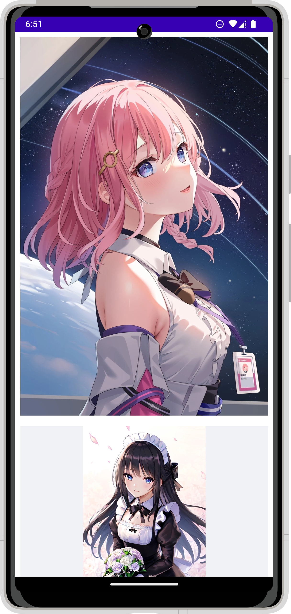
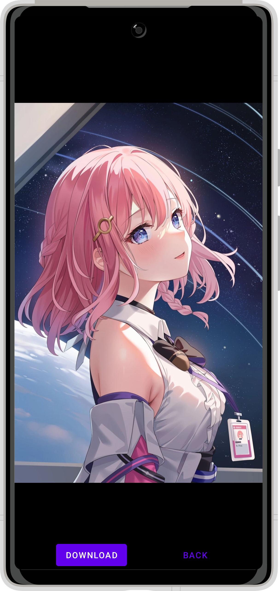

<h1 align="center">Nekos App</h1>
<h4 align="center">Unofficial Android App</h4>
:cat: <strong>NekosApp</strong> is an Android application that allows users to view and download random anime images.

## Features

- [x] View random images
- [x] View single image
- [x] Pinch zoom
- [x] Download

## Previews

|  |  |
|-----------------------------------------------------------------------|------------------------------------------------------------------------|
| 
Random Images List
                              | 
Download Image
                                   |

## Technologies and Frameworks

- **Kotlin**: A modern, concise, and interoperable programming language for Android development.
- **Coroutines**: Lightweight concurrency in Kotlin for writing non-blocking, asynchronous code.
- **Android Jetpack**: A set of libraries and tools to simplify and accelerate Android app development.
- **Retrofit**: A type-safe HTTP client for Android and Java, used to simplify API calls and network requests.
- **XML**: A markup language used for defining data structures, often used for layouts and data storage in Android development.

## Nekos API

The android app makes use of the [Nekos API](https://nekosapi.com/docs/api-introduction),
specifically the
REST [endpoint for getting random images](https://nekosapi.com/docs/images/random)
and [endpoint for getting an image by id](https://nekosapi.com/docs/images/details).
